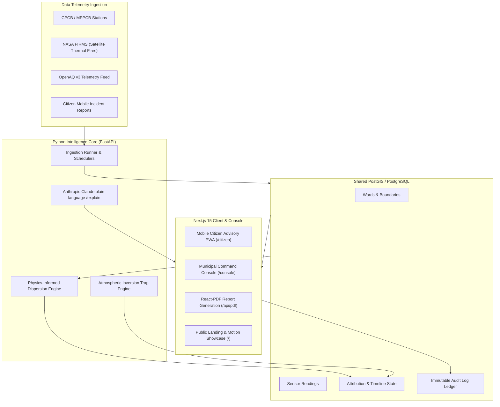

<div align="center">

# 🌬️ AirTrace MP
### Madhya Pradesh Air Quality & Probable Pollution Source Screening Platform
**मध्य प्रदेश वायु गुणवत्ता एवं स्रोत स्क्रीनिंग पोर्टल**

[](https://nextjs.org/)
[](https://react.dev/)
[](https://www.typescriptlang.org/)
[](https://fastapi.tiangolo.com/)
[](https://python.org/)
[](https://tailwindcss.com/)
[](https://orm.drizzle.team/)
[](https://neon.tech/)
[](https://clerk.com/)
[](https://maplibre.org/)
[](https://next-intl-docs.vercel.app/)

<br />


<br />
<br />

**A state-of-the-art environmental intelligence and micro-targeted pollution mitigation system built for Madhya Pradesh under the National Clean Air Programme (NCAP).**

[Explore Live Demo](http://localhost:3000) • [Citizen Portal](http://localhost:3000/citizen) • [Municipal Console](http://localhost:3000/console) • [Design System](http://localhost:3000/design) • [API Docs](http://localhost:8000/docs)

</div>

---

## 🌟 Executive Overview

**AirTrace MP** transforms complex atmospheric telemetry, satellite observations, and sensor fusion into actionable municipal enforcement tasks and public health advisories across **Bhopal**, **Indore**, and **Singrauli**.

Unlike traditional city-average monitoring, AirTrace delivers **hyperlocal, ward-level attribution**, tracking probable contributors (vehicular traffic, industrial smoke, road/construction dust, biomass fires, and secondary particulates), detecting meteorological **inversion traps**, and dispatching automated enforcement actions with an immutable audit trail.

---

## 📸 Visual Showcase

### 📱 1. Mobile-First Citizen Advisory Portal (`/citizen`)
Designed Hindi-first as a Progressive Web App (PWA) with offline shell caching, low-bandwidth mode, GPS-assisted ward detection, vulnerable demographic health advisories, and instant community incident reporting.

<div align="center">
  
</div>

### 🛡️ 2. Municipal Command Console & Workflow Engine (`/console`)
A role-governed command center for MPPCB officers and municipal authorities featuring live action workflows (`open` ➔ `in_progress` ➔ `done`), inversion-trap alerts, report moderation, versioned threshold calibrations, and state-wide audit logs with CSV export.

<div align="center">
  
</div>

---

## 🛠️ Complete Technology Stack

| Layer | Technologies | Purpose |
| :--- | :--- | :--- |
| **Frontend Web App** | **Next.js 15 (App Router)** + **React 19** | Server Components, SSR/SSG hybrid streaming, edge-ready architecture |
| **Backend & Engine** | **FastAPI** + **Python 3.11+** + **Pydantic v2** | Ingestion pipeline, dispersion heuristics, inversion trap detection, OpenAPI `/docs` |
| **Styling & Design Tokens** | **Tailwind CSS v4** + **shadcn/ui** | Zero-runtime CSS variables, CPCB standard AQI palettes, dark/light modes |
| **Motion & Interaction** | **Motion (`motion/react`)** + **Lenis Smooth Scroll** | Micro-animations, particle wind canvas, smooth momentum scrolling |
| **GIS & Geodata** | **MapLibre GL 5** + **GeoJSON Polygons** + **PostGIS** | Ward boundary choropleths, thermal fire anomaly clusters, dispersion cones |
| **Data Visualization** | **Recharts** + **Lucide Icons** | 24h hourly AQI trends, stacked source breakdown bar charts, responsive graphs |
| **Authentication & RBAC** | **Clerk (`@clerk/nextjs`)** | RS256 JWT role verification via `publicMetadata`, Svix webhooks, built-in demo mode |
| **Database & ORM** | **PostgreSQL (Neon / PostGIS)** + **Drizzle ORM** + **SQLAlchemy** | Shared relational database, type-safe migrations, spatial queries |
| **Document Engine** | **`@react-pdf/renderer`** | Server-side automated generation of official bilingual ward and city reports |
| **Internationalization** | **`next-intl`** | Full bilingual support across English and Hindi (`hi`), locale routing (`as-needed`) |
| **Security & Auditing** | **CSP, HSTS, Rate Limiter, Sanitizer** | Strict Content Security Policy, sliding-window rate limiting, immutable audit logs |

---

## 📐 System Architecture



---

## 🚀 Quick Start Guide

### 1. Prerequisites
- **Node.js:** `v20.x` or later
- **Python:** `3.11+`
- **Docker & Docker Compose** (for local PostGIS)
- **Git**

### 2. Clone and Setup Environment
```bash
git clone https://github.com/RudrakshMishra/AirTrace.git
cd AirTrace
cp .env.example .env.local
```

### 3. Frontend Setup (Next.js 15)
```bash
# Install frontend dependencies
npm install

# Run database migration & seed synthetic demo data
npm run db:generate
npm run db:migrate
npm run db:seed

# Launch Next.js web application
npm run dev
```
Open **[http://localhost:3000](http://localhost:3000)** in your browser.

> 💡 **Zero-Config Demo Mode:** AirTrace runs out of the box with zero external dependencies! If `DATABASE_URL` and Clerk keys are omitted, the application automatically uses comprehensive in-memory seed data with full State Admin access.

### 4. Backend Engine Setup (FastAPI & Pipeline)
```bash
# 1. Start PostGIS container
docker compose up -d

# 2. Setup virtual environment
python -m venv .venv
source .venv/bin/activate  # On Windows: .venv\Scripts\activate
pip install -e ".[dev]"

# 3. Run database migrations
alembic upgrade head

# 4. Fetch static GIS data and generate demo cache
python scripts/fetch_osm.py
python scripts/aggregate_population.py
python scripts/generate_demo_cache.py

# 5. Start FastAPI server
python -m airtrace.cli serve
```
Interactive OpenAPI documentation will be live at **[http://localhost:8000/docs](http://localhost:8000/docs)**.

---

## 🛡️ Role-Based Access Control (RBAC)

AirTrace enforces server-side role validation using Clerk `publicMetadata`:

| Role | Permissions | Accessible Routes |
| :--- | :--- | :--- |
| `viewer` | Read-only telemetry, station data, and public maps | `/console`, `/console/alerts` |
| `officer` | Update mitigation actions status and execution notes | `/console/actions`, `/console/alerts` |
| `moderator` | Moderate community incident reports (approve/reject) | `/console/reports` |
| `city_admin` | Manage officer assignments and threshold rules for their city | `/console/settings`, `/console/admin/users` |
| `state_admin` | Global superuser: access all cities, audit logs, and parameters | All `/console/*` routes including `/console/audit` |

---

## 📑 Automated PDF Report Service

AirTrace includes a headless PDF compilation pipeline via `@react-pdf/renderer`:

- **Endpoint:** `GET /api/pdf`
- **Query Parameters:**
  - `wardId`: Ward identifier (e.g., `bhopal-ward-1`)
  - `cityId`: City identifier (`bhopal`, `indore`, `singrauli`)
  - `lang`: Language preference (`en` or `hi`)
- **Direct Link Example:**
  ```text
  http://localhost:3000/api/pdf?wardId=bhopal-ward-1&lang=hi
  ```

---

## ⚖️ Statutory Disclaimer & NCAP Policy Notice

> **IMPORTANT STATUTORY NOTICE:**
> Indicative screening, not legal source apportionment. Modelled estimates and probable source shares derived from sensor fusion, dispersion heuristics, and satellite observations for rapid municipal response under NCAP guidelines. Regulatory enforcement and legal proceedings require certified reference-grade laboratory chemical mass balance analysis.

---

## 👨‍💻 Author & Repository

- **Repository:** [https://github.com/RudrakshMishra/AirTrace](https://github.com/RudrakshMishra/AirTrace)
- **Author:** [Rudraksh Mishra](https://github.com/RudrakshMishra)
- **License:** Open Environmental Public License under NCAP Madhya Pradesh Initiative.
